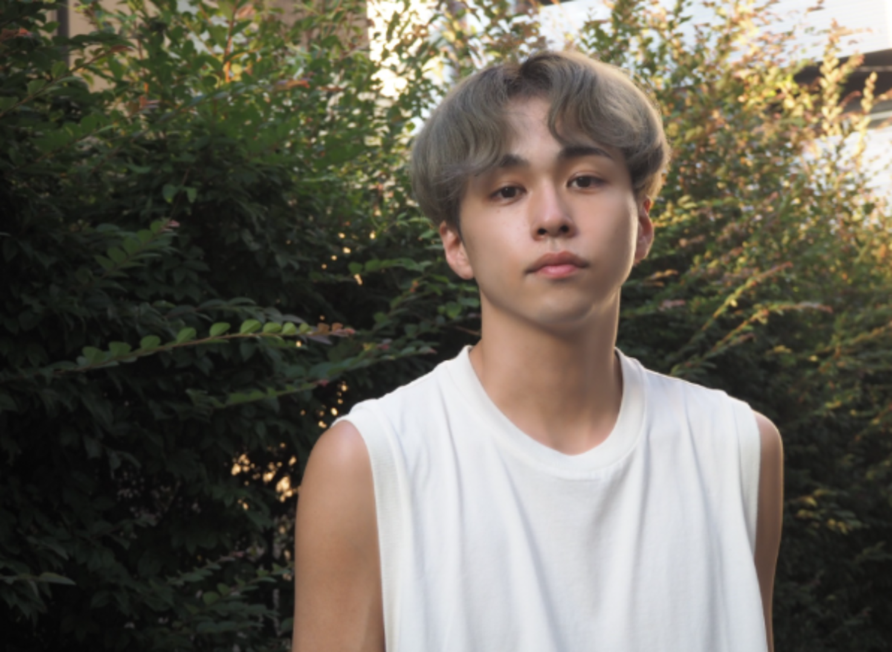

<!DOCTYPE html>
<html lang="ja">
<head>
    <meta charset="UTF-8">
    <meta name="viewport" content="width=device-width, initial-scale=1.0">
    <title>hair & make Luana</title>
    
</head>
<body>
    

        <header>
            

                hair & make
                Luana
            

            <nav>
                <ul>
                    <li>メニュー</li>
                    <li>スタッフ</li>
                    <li>ギャラリー</li>
                    <li>問合せ</li>
                </ul>
            </nav>
        </header>
        
        <main>
            

                
            

            
            

                <h2 class="announcement-item">お知らせ</h2>
                
→当社ヘアモデルのCM出演

                
→Amazon Prime人気恋愛リアリティー番組ラブトランジット出演カップルにご協力いただきAWコレクションレセプションに出席しました。

                
→もっと見る

            

        </main>
        
        <footer>
            
住所 東京都XXXX-XXX-XXX

            
電話番号 000-0000-0000

            
営業時間 00:00-24:00

            
定休日 火曜日

        </footer>
    

</body>
</html>
